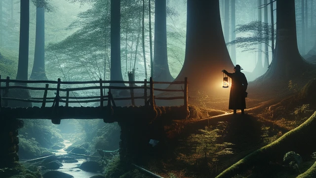

<link rel="stylesheet" type="text/css" href="style.css">

<h1> Kerosene Lamp Secrets</h1>

A mysterious adventure where the hero must build kerosene lamps to save the lives of house guests and learn their stories…

<i class="fa-solid fa-code fa-fade fa-xs" style="color: #000000;"></i>

#### Mystery4 Studio

Game Designer: [⋈ Mr. Veato (Denys Chebotaiev)](https://mrveato.com)

Programmer: Wladyslaw Pojner

3D Artist: Anastasiia Deribezova

2D Artist: Marharyta Bobukh

***

<a href="mailto:someone@yoursite.com"><i class="fa-regular fa-envelope fa-xl" style="color: #000000;"></i></a>
<a href="https://www.facebook.com/klsgame"><i class="fa-brands fa-facebook fa-xl" style="color: #000000;"></i></a>
<a href="https://twitter.com/klsgame"><i class="fa-brands fa-twitter fa-xl" style="color: #000000;"></i></a>
<a href="https://youtube.com/@kls-game"><i class="fa-brands fa-youtube fa-xl" style="color: #000000;"></i></a>
<a href="https://instagram.com/klsgame"><i class="fa-brands fa-instagram fa-xl" style="color: #000000;"></i></a>
<a href="https://www.tiktok.com/@klsgame"><i class="fa-brands fa-tiktok fa-xl" style="color: #000000;"></i></a>
<a href="https://t.me/klsgame"><i class="fa-brands fa-telegram fa-xl" style="color: #000000;"></i></a>

