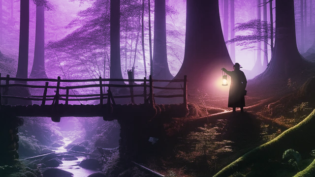

<meta name="description" content="A mysterious adventure by Mystery4 Studio where the hero must build kerosene lamps to save the lives of house guests and learn their stories…"/>
<meta name="author" content="Mystery4 Studio, mystery4studio@gmail.com">
<meta name="reply-to" content="mystery4studio@gmail.com">
<link rel="stylesheet" type="text/css" href="style.css">

<link rel="shortcut icon" type="image/x-icon" href="favicon.ico">

<h2 style="text-align:center"> Kerosene Lamp Secrets</h2>

Coming Soon on <a href="https://kerosenelampsecrets.com"><i class="fa-brands fa-steam fa-2xl" style="color: #000000;"></i></a>

<form novalidate="" class="sp-element-container sp-sm ">
<label class="sp-control-label">Email</label><input type="email" sp-type="email" name="sform[email]" class="sp-form-control " placeholder="email@mail.com" sp-tips="%7B%22required%22%3A%22Required%20field%22%2C%22wrong%22%3A%22Wrong%20email%22%7D" autocomplete="on" required="required">

<button id="sp-fa5d2149-93a6-4413-ab09-d5f29f1b18b3" class="sp-button">Subscribe </button>
</form>

 

A mysterious adventure where the hero must build kerosene lamps to save the lives of house guests and learn their stories.

Embark on a mystical journey in Kerosene Lamp Secrets. As a skilled inventor trapped in a mysterious mansion, use your creation, the kerosene lamp, to navigate pitch-black rooms. 

This game uniquely blends intense action with tranquil exploration, offering a mix of dialogue-driven narrative, engaging mini-games, and challenging puzzles. Your mission involves illuminating the mansion, uncovering the stories of other guests, battling against the creeping darkness, assembling lamps, unraveling secrets, and saving everyone from an uncertain fate.

<!-- Slideshow container -->

  <!-- Full-width images with number and caption text -->
  

    
1 / 3

    
    
Caption Text

  

  

    
2 / 3

    
    
Caption Two

  

  

    
3 / 3

    
    
Caption Three

  

  <!-- Next and previous buttons -->
  <a class="prev" onclick="plusSlides(-1)">&#10094;</a>
  <a class="next" onclick="plusSlides(1)">&#10095;</a>

 

<!-- The dots/circles -->

   
   
   

Join our community <a href="https://discord.gg/QSdtVEp3ZE"><i class="fa-brands fa-discord fa-xl" style="color: #727bf7;"></i></a>

<h4 style="text-align:center">Mystery4 Studio</h4>

Game Designer: [⋈ Mr. Veato (Denys Chebotaiev)](https://mrveato.com)

2D Artist: Marharyta Bobukh

3D Artist: Anastasiia Deribezova

Programmer: Wladyslaw Pojner

***

<a href="mailto:mystery4studio@gmail.com"><i class="fa-regular fa-envelope fa-xl" style="color: #000000;"></i></a>
<a href="https://www.facebook.com/klsgame"><i class="fa-brands fa-facebook fa-xl" style="color: #000000;"></i></a>
<a href="https://twitter.com/kls_game"><i class="fa-brands fa-twitter fa-xl" style="color: #000000;"></i></a>
<a href="https://youtube.com/@kls-game"><i class="fa-brands fa-youtube fa-xl" style="color: #000000;"></i></a>
<a href="https://instagram.com/klsgame"><i class="fa-brands fa-instagram fa-xl" style="color: #000000;"></i></a>
<a href="https://www.tiktok.com/@klsgame"><i class="fa-brands fa-tiktok fa-xl" style="color: #000000;"></i></a>
<a href="https://t.me/klsgame"><i class="fa-brands fa-telegram fa-xl" style="color: #000000;"></i></a>

